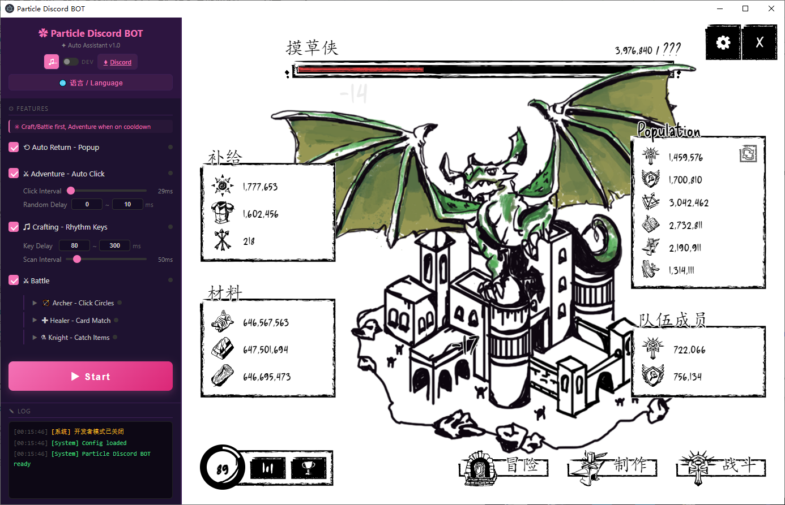
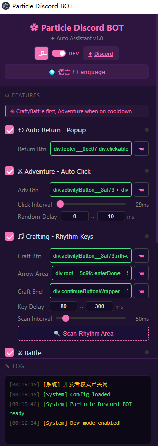
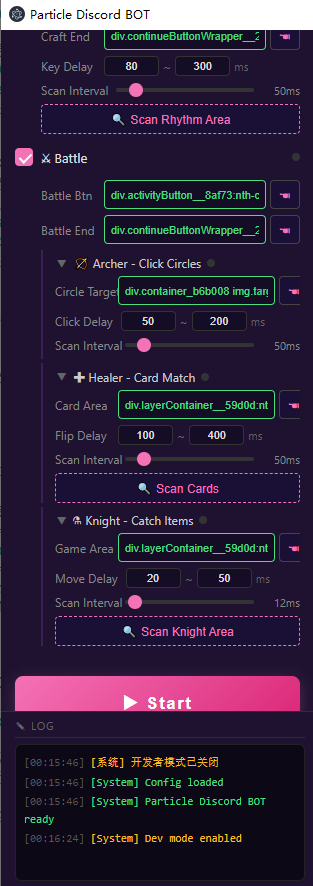

<p align="center">
  
</p>
 
<h1 align="center">&#10047; Particle Discord BOT</h1>

<p align="center">
  <b>Discord Mini-Game Automation Tool</b><br>
  Portable &bull; Bilingual &bull; Zero Config
</p>

<p align="center">
  <a href="#-download">Download</a> &bull;
  <a href="#-features">Features</a> &bull;
  <a href="#-quick-start">Quick Start</a> &bull;
  <a href="#-screenshots">Screenshots</a> &bull;
  <a href="#-architecture">Architecture</a> &bull;
  <a href="#-faq">FAQ</a> &bull;
  <a href="README_CN.md">中文文档</a> &bull;
  <a href="https://discord.gg/particle">Discord</a>
</p>

---

## &#128229; Download

Download the latest portable `.exe` from **[Releases](../../releases)** — no install needed, just run it.

> Each release includes a standalone `ParticleDiscordBOT.exe`. All data is stored next to the exe. No registry, no AppData pollution.

## &#9881; Features

| Module | Description |
|--------|-------------|
| **&#10226; Auto Return** | Auto-dismiss popup confirmation dialogs |
| **&#9876; Adventure** | Auto-click with configurable interval & random delay |
| **&#9835; Crafting** | Rhythm arrow key automation — reads sequences and presses keys |
| **&#127993; Archer** | Battle mode — auto-click circle targets with triple-event simulation |
| **&#10010; Healer** | Battle mode — card matching via SVG path fingerprint recognition |
| **&#9879; Knight** | Battle mode — auto-track & catch falling objects with mouse movement |

**Extras:**
- &#127760; **Bilingual UI** — Chinese / English toggle with full i18n (including logs)
- &#9835; **Mute Control** — one-click Discord audio mute
- &#9881; **Dev Mode** — element picker, DOM explorer, structure scanners
- &#128190; **Auto-Save Config** — all settings persist across sessions
- &#128230; **Portable** — single `.exe`, no install, data stored next to exe

## &#9733; Smart Priority System

```
Crafting Ready?  ──YES──>  Enter Crafting (rhythm keys)
       │ NO
Battle Ready?   ──YES──>  Enter Battle (auto-detect: Archer / Healer / Knight)
       │ NO
Adventure Btn?  ──YES──>  Auto-click Adventure (cooldown filler)
```

Crafting and Battle take priority. When both are on cooldown, Adventure auto-clicks to maximize efficiency.

## &#128640; Quick Start

**Option A: Download Release (Recommended)**
1. Download `ParticleDiscordBOT.exe` from [Releases](../../releases)
2. Run it — portable, no install needed
3. Log into Discord in the embedded browser
4. Enable desired modules, click **&#9654; Start**

**Option B: Build from Source**
```bash
git clone https://github.com/user/Discordgame.git
cd Discordgame
npm install
npm start          # Run in dev mode
npm run build      # Build portable .exe
```

## &#128248; Screenshots

<p align="center">
  
  &nbsp;&nbsp;
  
</p>

## &#127959; Architecture

```
┌─────────────────┐       IPC        ┌──────────────────┐
│  Control Panel   │ ──────────────> │  Electron Main    │
│  (renderer.js)   │ <────────────── │  (main.js)        │
└─────────────────┘                  └────────┬─────────┘
                                              │
                                   executeJavaScript()
                                   sendInputEvent()
                                              │
                                              v
                                   ┌──────────────────────┐
                                   │  Discord BrowserView  │
                                   │  (Embedded Browser)   │
                                   └──────────────────────┘
```

```
Discordgame/
├── main.js                 # Electron main process (window, IPC, input sim)
├── preload.js              # Control panel preload (discordBot API)
├── preload-discord.js      # Discord page preload (helper injection)
├── package.json
├── src/
│   ├── index.html          # Control panel UI
│   ├── styles.css          # Pink/magenta theme styles
│   └── renderer.js         # All automation logic, i18n, state machine
└── screenshots/
```

**Key Techniques:**
- `webContents.executeJavaScript()` — DOM query & manipulation inside Discord
- `webContents.sendInputEvent()` — Chromium-level mouse/keyboard simulation
- SVG `<path d>` fingerprinting — identify card faces even when visually hidden
- CSS selector auto-detection — battle sub-type routing (Archer/Healer/Knight)
- Triple-click strategy — `element.click()` + `PointerEvent` + `MouseEvent` for max compatibility

## &#10067; FAQ

**Q: Do I need to keep the window focused?**
A: No. All automation runs in-process — works minimized or in background.

**Q: Will selectors break after Discord updates?**
A: Possibly. Use Dev Mode's element picker to re-grab selectors when needed.

**Q: Is this detectable?**
A: This tool operates at the Electron/Chromium level within a local browser instance.

**Q: Where is my config saved?**
A: `config.json` next to the exe. Delete it to reset all settings.

---

<p align="center">
  <b>&#9830; <a href="https://discord.gg/particle">Join our Discord</a> &#9830;</b><br>
  Made with &#10047; by Particle
</p>
