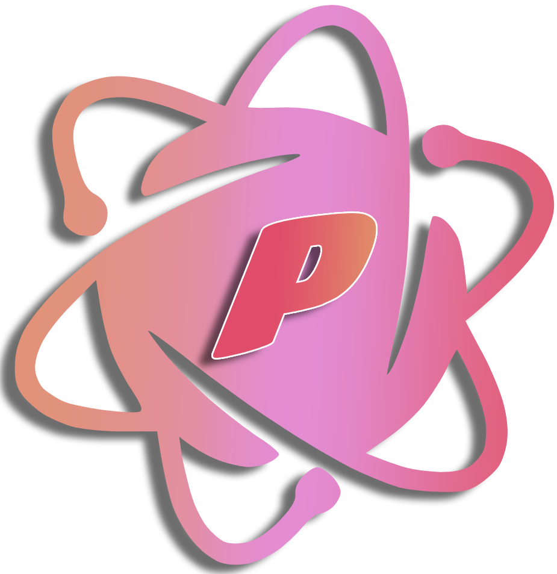

<p align="center">
  
</p>

<h1 align="center">Particle Discord BOT</h1>

<p align="center">
  
</p>

<p align="center">
  <b>Discord 小游戏自动化工具</b><br>
  便携版 &bull; 中英双语 &bull; 零配置
</p>

<p align="center">
  <a href="#-下载">下载</a> &bull;
  <a href="#-功能">功能</a> &bull;
  <a href="#-快速开始">快速开始</a> &bull;
  <a href="#-截图">截图</a> &bull;
  <a href="#-架构">架构</a> &bull;
  <a href="#-常见问题">FAQ</a> &bull;
  <a href="README.md">English</a> &bull;
  <a href="https://discord.gg/particle">Discord</a>
</p>

---

## &#128229; 下载

从 **[Releases](../../releases)** 下载最新的便携版 `.exe` —— 免安装，双击即用。

> 每个版本包含独立的 `ParticleDiscordBOT.exe`。所有数据存储在 exe 同级目录，不写注册表，不污染 AppData。

## &#9881; 功能

| 模块 | 说明 |
|------|------|
| **&#10226; 自动返回** | 自动检测并关闭弹窗确认 |
| **&#9876; 冒险** | 自动连点冒险按钮，可配置间隔和随机延迟 |
| **&#9835; 制作** | 节奏方向键自动化 — 读取箭头序列并自动按键 |
| **&#127993; 射手** | 战斗模式 — 三重事件模拟自动点击圆圈目标 |
| **&#10010; 牧师** | 战斗模式 — SVG 路径指纹识别翻牌配对 |
| **&#9879; 骑士** | 战斗模式 — 鼠标自动追踪接住掉落物 |

**额外功能：**
- &#127760; **中英文切换** — 全界面 + 日志双语支持
- &#9835; **一键静音** — 控制 Discord 音频
- &#9881; **开发者模式** — 元素选取器、DOM 浏览器、结构扫描器
- &#128190; **配置自动保存** — 所有设置自动持久化
- &#128230; **便携版** — 单 exe 运行，无需安装

## &#9733; 智能优先级系统

```
制作就绪?  ──是──>  进入制作（节奏方向键）
    │ 否
战斗就绪?  ──是──>  进入战斗（自动检测：射手 / 牧师 / 骑士）
    │ 否
冒险按钮?  ──是──>  自动连点冒险（冷却期填充）
```

制作和战斗优先执行。进入战斗后自动检测子类型（射手/牧师/骑士）。当制作和战斗都在冷却时，自动连点冒险以最大化效率。

## &#128640; 快速开始

**方式一：下载发布版（推荐）**
1. 从 [Releases](../../releases) 下载 `ParticleDiscordBOT.exe`
2. 双击运行，免安装
3. 在内嵌浏览器中登录 Discord
4. 勾选需要的功能模块，点击 **&#9654; 开始运行**

**方式二：从源码构建**
```bash
git clone https://github.com/user/Discordgame.git
cd Discordgame
npm install
npm start          # 开发运行
npm run build      # 构建便携版 exe
```

## &#128248; 截图

<p align="center">
  
  &nbsp;&nbsp;
  
</p>

## &#127959; 架构

```
┌─────────────────┐       IPC        ┌──────────────────┐
│  控制面板 UI      │ ──────────────> │  Electron 主进程   │
│  (renderer.js)   │ <────────────── │  (main.js)        │
└─────────────────┘                  └────────┬─────────┘
                                              │
                                   executeJavaScript()
                                   sendInputEvent()
                                              │
                                              v
                                   ┌──────────────────────┐
                                   │  Discord BrowserView  │
                                   │  (内嵌浏览器)          │
                                   └──────────────────────┘
```

```
Discordgame/
├── main.js                 # Electron 主进程（窗口管理、IPC、输入模拟）
├── preload.js              # 控制面板 preload（暴露 discordBot API）
├── preload-discord.js      # Discord 页面 preload（注入辅助函数）
├── package.json
├── src/
│   ├── index.html          # 控制面板 UI
│   ├── styles.css          # 粉色/品红主题样式
│   └── renderer.js         # 所有自动化逻辑、i18n、状态机
└── screenshots/
```

**核心技术：**
- `webContents.executeJavaScript()` — 在 Discord 页面内执行 DOM 查询和操控
- `webContents.sendInputEvent()` — Chromium 级鼠标/键盘输入模拟
- SVG `<path d>` 指纹识别 — 即使卡牌视觉上翻转也能识别正面图案
- CSS 选择器自动检测 — 战斗子类型路由（射手/牧师/骑士）
- 三重点击策略 — `element.click()` + `PointerEvent` + `MouseEvent` 最大兼容

## &#10067; 常见问题

**Q: 需要保持窗口在前台吗？**
A: 不需要。所有自动化在进程内运行，最小化或后台均可正常工作。

**Q: Discord 更新后选择器会失效吗？**
A: 有可能。使用开发者模式的元素选取器重新获取即可。

**Q: 配置保存在哪里？**
A: exe 同级目录的 `config.json`。删除即可重置所有设置。

## &#9888; 注意事项

- 首次启动需要在内嵌浏览器中登录 Discord 账号
- Discord 更新后 CSS 选择器可能变化，使用开发者模式重新获取
- 点击间隔建议不低于 50ms，过低可能影响性能
- 所有配置修改会自动保存，下次启动自动恢复

---

<p align="center">
  <b>&#9830; <a href="https://discord.gg/particle">加入我们的 Discord</a> &#9830;</b><br>
  Made with &#10047; by Particle
</p>
